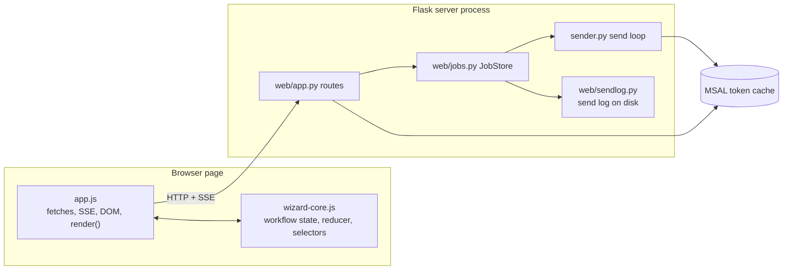
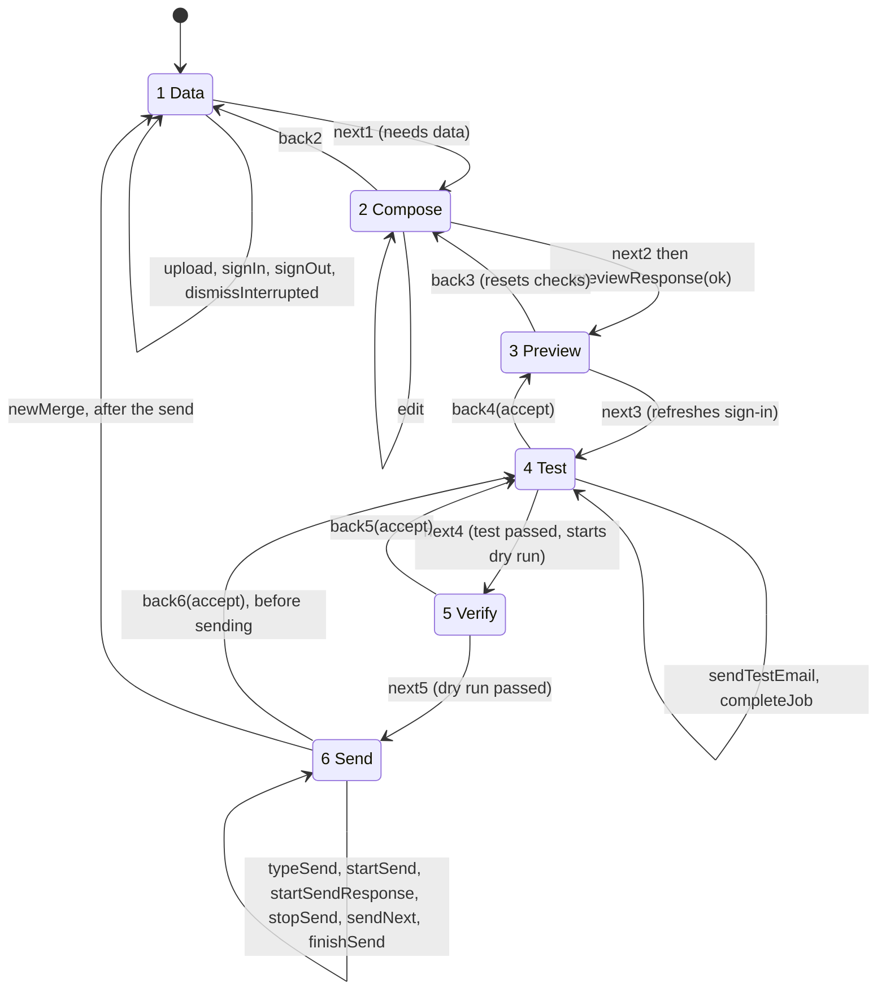
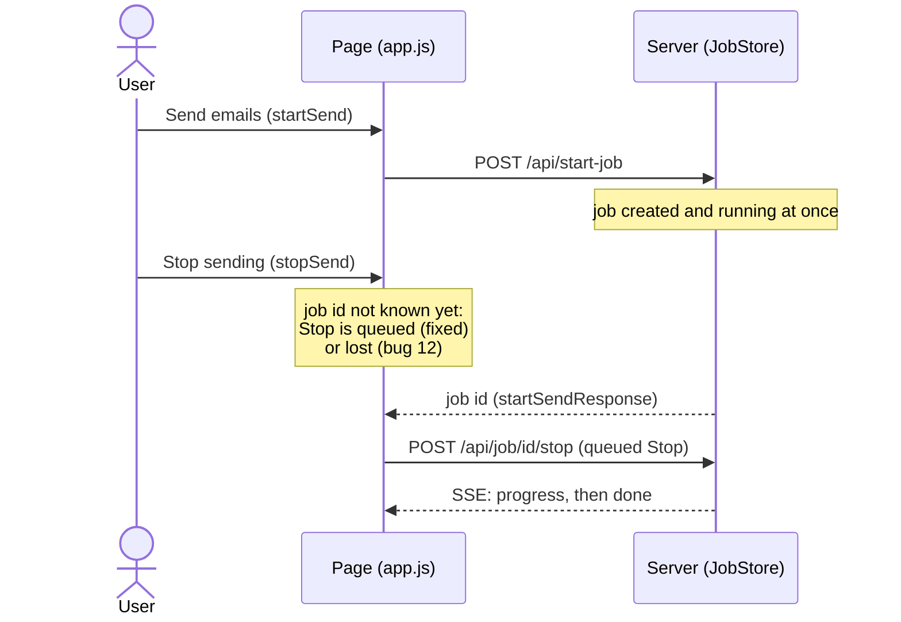
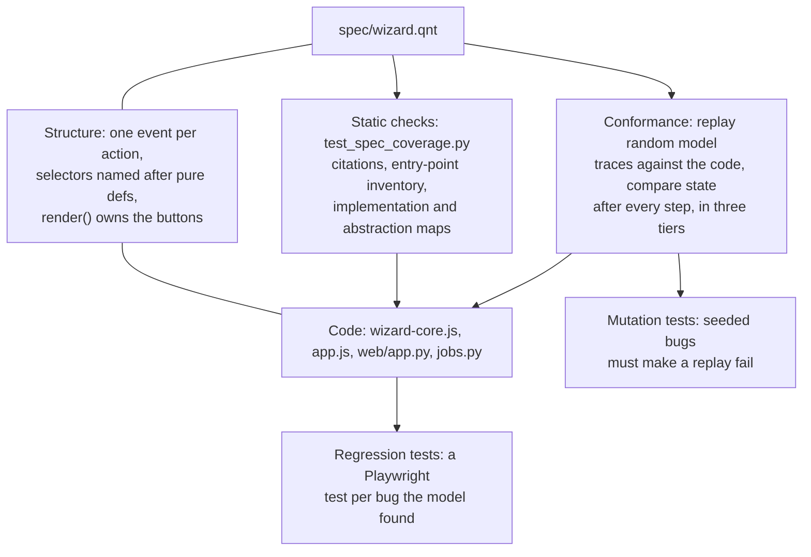
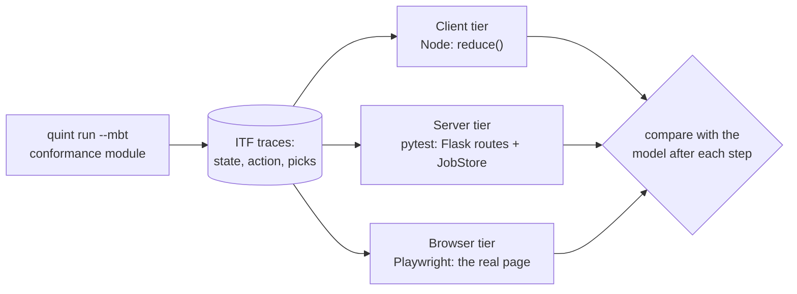

# The Quint model of the web wizard

`spec/wizard.qnt` is a formal model of the web UI's workflow: the six wizard steps, the test email, the dry run and the send, the background jobs that carry them out, sign-in, page reloads and server restarts. It states what must always be true, and tools check that every reachable state satisfies it. Tests then check that the code behaves as the model says.

This document explains the model, how it is checked, and how the implementation is kept in line with it. It is a maintenance guide: the last section says what to update when the code changes. The history of how the model was built, and the seventeen bugs it found, is in [`archive/quint-model-plan.md`](../archive/quint-model-plan.md).

Contents:

1. [Why a model](#1-why-a-model)
2. [Where everything lives](#2-where-everything-lives)
3. [Quick start](#3-quick-start)
4. [What the model covers](#4-what-the-model-covers)
5. [State](#5-state)
6. [Actions](#6-actions)
7. [Three variants: buggy, partial, fixed](#7-three-variants-buggy-partial-fixed)
8. [Requirements and invariants](#8-requirements-and-invariants)
9. [Checking the model](#9-checking-the-model)
10. [How the implementation is kept matching the model](#10-how-the-implementation-is-kept-matching-the-model)
11. [Maintaining the model](#11-maintaining-the-model)
12. [Glossary](#12-glossary)

## 1. Why a model

The wizard looks like a straight line from step 1 to step 6, but it isn't. Test emails, dry runs and sends run as background jobs on the server and finish whenever they finish. Requests the page is waiting for can come back after the user has moved on. The user can go back, edit, reload the page or sign out at any moment, and the server can be restarted in the middle of a send. Bugs live in the interleavings, and tests written by hand rarely think of them.

A model checker explores those interleavings exhaustively, up to a bound. Each of the seventeen bugs found while building the model was an interleaving of this kind, for example:

- a test email that finishes after the user has gone back and edited the message marks the *edited* message as tested (bug 1);
- "Stop sending" pressed before the server has confirmed the send goes to the previous dry run and is lost (bug 12);
- a reload before the start-job response arrives leaves a real send running with nothing on screen (bug 11).

The table of all seventeen, with their regression tests, is in the archived plan.

## 2. Where everything lives

| File | What it is |
|---|---|
| `spec/wizard.qnt` | The model: state, actions, invariants, scenarios, and the `conformance` module used to generate test traces |
| `spec/requirements.md` | The user-facing requirements (R1–R17), each with the invariant that checks it |
| `spec/coverage.toml` | Every entry point in the UI and server, mapped to model actions; how each action is implemented; which model fields the abstraction functions leave out |
| `spec/check.sh` | Runs the Apalache model checker over every invariant |
| `spec/package.json`, `spec/package-lock.json` | Quint, pinned to 0.32.0 |
| `src/mail_merge/web/static/wizard-core.js` | The page's workflow logic as a pure reducer, with one event per model action and selectors named after the model's definitions |
| `src/mail_merge/web/jobs.py` | The server's job lifecycle (`JobStore`), with an `abstract()` method returning the model's server fields |
| `tests/test_spec_coverage.py` | Static checks that keep the model, the inventory, the requirements and the code in step |
| `tests/test_conformance.py`, `tests/js/conformance.test.js`, `tests/test_conformance_e2e.py` | Conformance tests: replay model traces against the code |
| `tests/test_web_e2e_workflow.py` | Playwright regression tests, one or more per bug the model found |

## 3. Quick start

```sh
npm ci --prefix spec --ignore-scripts         # install the pinned Quint
Q=spec/node_modules/.bin/quint

$Q typecheck spec/wizard.qnt
$Q test --main=fixed --max-samples=1 --backend=typescript spec/wizard.qnt    # scenarios, seconds
$Q run spec/wizard.qnt --main=conformance --init=cInit --step=cStep \
   --backend=typescript --invariant=allInvariants \
   --max-samples=2000 --max-steps=120                                           # random simulation, ~2 min (CI: 500 x 60, ~15 s)

uv run pytest tests/test_spec_coverage.py tests/test_conformance.py            # static checks + conformance
uv run pytest tests/test_conformance_e2e.py                                    # browser tier (Chromium)

QUINT=$Q spec/check.sh --all fixed            # Apalache, all invariants, about 2 hours (needs Java)
```

## 4. What the model covers

The model covers the workflow layer of the web UI: what step the page is on, what it believes has been checked, which buttons work, which requests and jobs are in flight, and what the server knows about them.



Every box is in scope as far as it affects the workflow. These are deliberately left out (they are tested by ordinary tests, or are not state-machine problems):

| Out of scope | Why |
|---|---|
| Template rendering and placeholders | Pure functions; the JS and Python rules are kept in line by `test_render_template_matches_server` |
| Rich-text editing and paste sanitisation | Not workflow state; covered by `test_web_e2e.py` |
| Graph API retries inside `send_one` | One email is one atomic `sendNext` in the model |
| SSE framing, CSS layout | Not state |
| The CLI | The model is the web UI only. The CLI's resume bug (bug 16) was fixed with ordinary tests |
| A second tab, session expiry, out-of-order sign-in answers, sheet-change view state | Open; listed in `TODO.md` |

Anything a user or the server can trigger must be either modelled or excluded with a reason in `spec/coverage.toml` (see [§10.2](#102-static-checks)).

### Abstractions

The model is small because it abstracts:

- **Content is a number.** Everything that determines what gets sent (spreadsheet, sheet, subject, body, options) is one integer, `version`, bumped by every upload and edit. A check "was made for this content" means its version equals the current one.
- **Three recipients.** `TOTAL = 3` is enough for "Stop is pressed, then two more emails would go out".
- **Jobs complete later.** Starting a job and its completion are separate actions, so a completion can land after any number of other actions.
- **Awaits are split.** A handler that `awaits` a response which changes the page is two actions: the request and the response. Clicks can land in between. The recipient preview (`next2` / `previewResponse`) and starting a send (`startSend` / `startSendResponse`) are modelled this way.

## 5. State

The whole system state is one record, `s`. Its fields fall into six groups:

| Group | Fields | Mirrors |
|---|---|---|
| Page workflow | `step`, `dataLoaded`, `version`, `testPassed`, `verifyPassed`, `sendStarted`, `testGen`, `verifyGen`, `previewGen`, `recipientsVersion` | `state` in `wizard-core.js` |
| DOM projection | `btnNext2`, `btnSendTest`, `btnNext4`, `btnNext5`, `btnDoSend`, `btnBack6`, `doneNav`, `verifyShown`, `resultsShown`, `interruptedShown`, `progressJob`, `bccToMerge` | Button `disabled` states and visible panels (true = enabled or shown) |
| In flight | `pending` (jobs the page is listening to), `previewReq`, `sendReq` | Requests and SSE streams the page is waiting on |
| Server | `sessionJob`, `sendJob`, `nextJobId`, `sendLog` | `session["job_id"]`, `JobStore`, the send log on disk |
| Sign-in | `signedIn` (the token cache), `authShown` (what the page last showed) | MSAL cache vs `_auth.isSignedIn` |
| Ghost | `testedVersions`, `verifiedVersions`, `realSendStarted`, `untestedSend`, `sentAfterStop`, `interactiveAuthInJob`, `stepJump`, `concurrentSends`, `mergeId`, `lostSend`, `stopLost`, `stopQueued` | Nothing in the code: a record of what really happened, for the invariants |

Two design points matter.

**What the page shows is separate from the truth.** `signedIn` is whether the token cache can produce a token; `authShown` is what the page last learnt from `/auth/status`. A token can expire between the two (`tokenExpires`), and the invariants are about what the user can do given what the page shows.

**Ghost fields record reality.** The code never knows whether the current content was really test-sent; the model does, because `complete` adds the job's version to `testedVersions` when the server's job succeeds:

```quint
  // Completion of job `j` (SSE "done" + /status) with outcome `ok`.
  pure def complete(st: State, j: Job, ok: bool): State = {
    val st0 = { ...st, pending: st.pending.exclude(Set(j)) }
    // Ghost: what the server actually did.
    val st1 = { ...st0,
      testedVersions: if (ok and j.kind == Test) st0.testedVersions.union(Set(j.version)) else st0.testedVersions,
      verifiedVersions: if (ok and j.kind == Verify) st0.verifiedVersions.union(Set(j.version)) else st0.verifiedVersions,
    }
```

An invariant can then say "if Next on step 4 is enabled, the current version was really tested", which is a statement the code itself cannot make.

Jobs carry the content version they ran with and the generation they were started in:

```quint
  type Job = {
    id: int,
    kind: Kind,      // mode sent to /api/start-job
    handler: Kind,   // which completion callback the page attached
    version: int,    // content version the job ran with
    gen: int,        // generation stamp (only checked when FIXED)
  }
```

## 6. Actions

An action is one atomic thing that can happen. The model's `step` relation offers 30 of them, and at each step any enabled one may be taken. The diagram shows the user's actions between steps (Back moves to step 4 from step 6, not to step 5, as in the UI):



`reload` and `serverRestart` can happen anywhere. A reload returns to step 1, unless a send is running or the session's last job was a send, in which case it goes to step 6 (showing the progress or the results). A restart always returns to step 1.

### User actions

| Action | Guard (when it can happen) | Code it transcribes |
|---|---|---|
| `upload` | step 1 | `#spreadsheet-file` and `#sheet-select` change; `api_upload_spreadsheet`, `api_change_sheet` |
| `next1` | step 1 | `goToStep(2)` |
| `edit(bcc)` | step 2 | compose input listeners, `onTemplateChange()`, `setSendMode()` |
| `back2` | step 2 | `goToStep(1)` |
| `next2` | step 2, Next enabled | `goToStep(3)`, `loadPreview()`; `api_get_recipients` |
| `back3` | step 3 | `confirmGoBack(2)` |
| `next3` | step 3 | `goToStep(4)` |
| `sendTestEmail` | step 4, `sendTestEnabled` | `sendTestEmail()`; `api_start_job` (test_email) |
| `back4(accept)` | step 4 | `confirmGoBack(3)`; `accept` is the answer to the confirm dialog |
| `next4` | step 4, Next enabled | `goToStep(5)`, which starts the dry run |
| `back5(accept)` | step 5 | `confirmGoBack(4)` |
| `next5` | step 5, Next enabled | `goToStep(6)`, `prepareSend()` |
| `typeSend` | step 6, not sending | typing SEND in `#send-confirm-input` |
| `startSend` | step 6, `doSendEnabled` | `startSend()`; `api_start_job` (send) |
| `back6(accept)` | step 6, before sending | `confirmGoBack(4)` |
| `stopSend` | step 6, sending, not done | `stopSend()`; `api_job_stop` |
| `newMerge` | step 6, done | `newMerge()`; `api_reset` |
| `dismissInterrupted` | step 1, report shown | `dismissInterrupted()`; `api_dismiss_interrupted` |
| `signIn(desktop)` | `signInOffered`, page shows signed out | sign-in buttons and poll; `auth_login`, `auth_callback`, `auth_interactive` |
| `signOut` | step 1, page shows signed in | `doSignOut()`; `auth_logout` |
| `reload` | always | `DOMContentLoaded`, `loadConfig()`; `api_config` |

### Environment actions

These are things the user doesn't do: responses arriving, the server finishing work, the world changing.

| Action | What happens |
|---|---|
| `previewResponse(ok)` | The recipient list for a pending preview arrives, or the request fails |
| `startSendResponse` | The start-job response for a send arrives: the page learns the job id |
| `completeJob(ok)` | A test email or dry run finishes on the server |
| `completeOrphan` | A job finishes with no page listening (its page was reloaded away) |
| `sendNext` | The send loop sends one email |
| `finishSend(failed)` | The send loop ends: all sent, stopped, or failed |
| `sendWithoutToken` | The send loop needs a token and the cache has none |
| `tokenExpires` | The cached token stops working |
| `serverRestart` | The server process ends (quit or crash) and a new one starts |

### Shared guards

What the page offers is written once, as pure definitions, and used both by the actions' guards and by the invariants, so the two can't drift apart. The same names are used for the selectors in `wizard-core.js`:

```quint
  // The sign-in button: on step 1 always, and (FIXED) in the callout that
  // steps 4 and 6 show while the page shows signed out.
  pure def signInOffered(st: State): bool =
    st.step == 1
      or (FIXED and not(st.authShown)
          and (st.step == 4 or (st.step == 6 and not(st.sendStarted))))

  // "Send test email" can be clicked. FIXED: also disabled while signed out.
  pure def sendTestEnabled(st: State): bool =
    st.btnSendTest and (not(FIXED) or st.authShown)
```

### Request and response: the await windows

`startSend` and `startSendResponse` show why awaits are split. Between the click and the response, the user can press Stop, reload, or do nothing while the server sends:



The model transcribes this exactly. In the `stopSend` action, a Stop pressed while the start-job request is pending is queued in the fixed code and lost in the buggy code:

```quint
  action stopSend = all {
    s.step == 6, s.sendStarted, not(s.doneNav),
    act("stopSend",
      if (s.sendReq.size() > 0) {
        if (FIXED2) { ...s, stopQueued: true }
        else { ...s, stopLost: s.stopLost or s.sendJob.exists(j => j.status == Running) }
      } else { ...s,
        sendJob: s.sendJob.map(j =>
          if (j.status == Running)
            { ...j, stopRequested: true, stopEarly: j.stopEarly or j.sent < TOTAL }
          else j) }),
  }
```

### Every action cites its code

The comment above each action names the code it transcribes, as `app.js: …`, `web/app.py: …` or `environment: …`. A test enforces it ([§10.2](#102-static-checks)). The rule is to copy guards and effects from the code, faults included, not from what the code was meant to do: a model written from intent passes every check and proves nothing.

## 7. Three variants: buggy, partial, fixed

The model describes three versions of the code at once. A constant `ROUND` selects one, and each bug fix is gated on the round that fixed it:

```quint
module wizard {
  const ROUND: int
  pure val FIXED = ROUND >= 1
  pure val FIXED2 = ROUND >= 2
```

```quint
module buggy {
  import wizard(ROUND = 0).*
}

module partial {
  import wizard(ROUND = 1).*
}

module fixed {
  import wizard(ROUND = 2).*
}
```

| Variant | Code it describes | Expected result |
|---|---|---|
| `buggy` | Before any fix | Each bug's invariant is violated |
| `partial` | Round 1 fixes (bugs 1–9) only | Round 2 invariants (bugs 10–15) violated |
| `fixed` | The current code | Every invariant holds |

Keeping the buggy behaviour in the model documents each bug precisely and proves the invariant would catch it. A typical fix reads:

```quint
  // The recipient list arrives (`ok`) or the request fails (an alert). Next
  // is re-enabled either way.
  // Bug: loadPreview() writes the list into whatever state.spreadsheetData
  // now is, and goToStep() then sets step 3 wherever the page is, so a Back,
  // an edit or a new upload while waiting is overridden.
  // FIXED2: a response whose preview generation is stale is dropped.
  // environment: app.js loadPreview() and goToStep(3) after `await`; web/app.py api_get_recipients
  action previewResponse(ok: bool): bool = all {
    s.previewReq.size() > 0,
    nondet r = s.previewReq.oneOf()
    val st = { ...s, previewReq: s.previewReq.exclude(Set(r)), btnNext2: true }
    val current = not(FIXED2) or (r.gen == s.previewGen and s.step == 2)
```

`buggy` and `partial` are frozen: they can't be replayed against today's code, so conformance runs against `fixed` only. A future bug is transcribed into `fixed` as the code has it, shown to break an invariant, then fixed in the code and the model together, with a scenario recording it. Bug 17 (the send log) was done this way, gated on `FIXED2` rather than a new round.

## 8. Requirements and invariants

`spec/requirements.md` lists what the wizard must do, in plain language, and names the invariant that checks each requirement. An invariant is a statement about a single state that must hold in every reachable state.

| Req. | Requirement (abridged) | Invariants |
|---|---|---|
| R1 | Step 2 needs a spreadsheet | `stepNeedsData` |
| R2, R8 | Steps 4 and 6 can always be finished from the step itself; step 5 always shows a dry run or its result | `canProgress` |
| R3 | Signed out on step 4: test email disabled, sign-in offered | `testNeedsSignIn` |
| R4 | Send only while signed in; step 6 offers sign-in | `sendNeedsSignIn` |
| R5 | No job waits for interactive sign-in | `noInteractiveAuthInJob` |
| R6 | Nothing false is claimed or sent | `noUntestedSend`, `next4Honest`, `next5Honest`, `buttonsMatchFlags`, `sendScreenHonest`, `sendScreenNotStuck`, `back6Usable` |
| R7 | Stop stops before the next email; a stopped send is reported as stopped | `stopHonoured`, `stoppedReported` |
| R9 | A send that fails part-way lists what went out | `failedSendReported` |
| R10 | Progress text describes the send under way | `progressHonest` |
| R11 | A late response never moves the page from a step the user left | `noStepJump` |
| R12 | Recipients shown were fetched for the current content | `previewHonest` |
| R13 | A running send is always on screen; one send at a time | `runningSendVisible`, `noConcurrentSends` |
| R14 | New merge clears every input | `newMergeClears` |
| R15 | A restart mid-send records and reports what went out | `restartReported`, `interruptedVisible` |
| R16 | The sign-in display follows the latest answer | None in the model (holds by construction in the code) |
| R17 | Buttons on steps 4–6 follow the workflow state alone | `buttonsDerived` |

The headline invariant uses ghost state to say that a real send only goes out for content that was test-sent and dry-run in its current form. `startSend` records whether that was true:

```quint
  action startSend = all {
    s.step == 6, not(s.sendStarted), doSendEnabled(s),
    val ok = s.testedVersions.contains(s.version) and s.verifiedVersions.contains(s.version)
    act("startSend", { ...s,
      // … (the sending screen, the new job, the start-job request)
      realSendStarted: true, untestedSend: s.untestedSend or not(ok) }),
  }
```

```quint
  /// A real send only starts for content that was test-sent and dry-run.
  val noUntestedSend = not(s.untestedSend)
```

The dead-end check is computed from the same guards the actions use, so it can't drift from them:

```quint
  val canProgress =
    (s.step == 4 implies (
        s.pending.exists(p => p.handler == Test)
        or (s.btnNext4 and s.testPassed)
        or (sendTestEnabled(s) and s.authShown)
        or signInOffered(s)))
    and (s.step == 5 implies (s.pending.exists(p => p.handler == Verify) or s.verifyShown))
    and ((s.step == 6 and not(s.sendStarted)) implies (s.authShown or signInOffered(s)))
```

All 24 invariants are combined in `allInvariants`, which `spec/check.sh` and the CI simulation check.

### Witnesses

Some states are allowed but worth knowing about. A witness is a condition the simulator counts rather than forbids, for example a job finishing with no page listening (`orphanJob`) or the page showing signed in after the token has gone (`staleSignIn`). `spec/requirements.md` records how often each is reached and why it is acceptable.

## 9. Checking the model

Three tools check the model, from fast and shallow to slow and exhaustive.

| Check | Command | What it does | Time |
|---|---|---|---|
| Scenarios | `quint test --main=<variant>` | 23 hand-written traces, one per bug plus a happy path | Seconds |
| Simulation | `quint run --step=cStep --invariant=allInvariants` | Thousands of random traces of 120 steps | ~2 min for 2,000 |
| Bounded model checking | `spec/check.sh [--all] <variant>` | Apalache proves every invariant for every trace up to 16 steps (19 in the deepest run) | ~2 h (`--all fixed`, 4 cores); each extra step about 2½ times as long |

### Scenarios

Each scenario replays one counterexample and asserts that the invariant fails in the variants that have the bug and holds in those that don't. `bugIff` (round 1) and `bugIff2` (round 2) express that:

```quint
  pure def bugIff(inv: bool): bool = if (FIXED) inv else not(inv)

  /// Stop pressed before the start-job response arrives is lost (bug 12).
  run earlyStopTest =
    start.then(toStep4).then(passTestAndVerify(0))
      .then(next5).then(typeSend).then(startSend).then(stopSend).then(startSendResponse)
      .expect(bugIff2(stopHonoured)
        and (FIXED2 implies s.sendJob.forall(j => j.stopRequested)))
```

Run them for all three variants: a scenario that passes in `fixed` but also in `buggy` no longer shows the bug.

### Simulation

Simulate with `cStep` from the `conformance` module (see [§10](#10-how-the-implementation-is-kept-matching-the-model)), not the model's own `step`. Uniform random traces of `step` rarely get past step 3, because reloads, restarts and Back keep returning the page to the start. Checked against the long bugs in `buggy` and `partial` that Apalache misses at 16 steps (`noUntestedSend`, `back6Usable`, `stoppedReported`, `noConcurrentSends`, `progressHonest`, `newMergeClears`), 20,000 uniform traces of 60 steps found none of them, while 2,000 `cStep` traces of 120 steps found every one with each of five seeds. `noConcurrentSends` was the slowest, at about 830 traces.

CI runs a smaller simulation, 500 traces of 60 steps (about 15 seconds), as a smoke test, because CI time costs money. With five seeds it found `back6Usable`, `progressHonest` and `newMergeClears` every time, `stoppedReported` three times, `noUntestedSend` twice and `noConcurrentSends` never. Run the 2,000 × 120 simulation and Apalache locally before pushing a change to the model or to the code it describes.

Simulation does not find bugs that need a long, exact sequence. `next5Honest` in `buggy` (a stale dry run completing after Back, Back, Back, an edit and a new test) was not found in 50,000 `cStep` traces at any `GAP` from 0 to 8; only its scenario and a deep enough Apalache run check it.

The default backend downloads Quint's Rust evaluator from GitHub (outside the lockfile) and is about 7 times as fast; CI uses `--backend=typescript`.

### Apalache

`spec/check.sh` runs each invariant through `quint verify`, which uses the Apalache model checker. A violation prints the trace of action names that reaches it. Apalache is too slow for every push, so CI runs scenarios and simulation instead; run `spec/check.sh --all fixed` locally whenever `spec/wizard.qnt` changes. It needs Java and a free local port 8822. The last run (after bug 17) found no violation of any of the 24 invariants within 16 steps.

Apalache checks one step at a time, and each step takes about 2½ times as long as the one before. One run of `allInvariants` on `fixed` with `--max-steps=22` on an 8-core, 24 GB Apple Silicon Mac (2026-10-04, with a 12 GB heap, and sharing the CPU with simulations until step 17) finished each step at:

| Step | Elapsed | This step |
|---|---|---|
| 14 | 13 min | 7 min |
| 15 | 28 min | 15 min |
| 16 | 1 h 2 min | 34 min |
| 17 | 1 h 55 min | 53 min |
| 18 | 3 h 33 min | 1 h 38 min |
| 19 | 7 h 16 min | 3 h 43 min |

Every invariant held up to 19 steps; step 20 had not finished after 11 hours. Running alone, the first 15 steps took 13 minutes. A bound beyond 20 needs a model with shorter routes to the later steps (see `TODO.md`), not more machine time.

For a long run, raise Apalache's heap (its launcher defaults to 4 GB) and keep the machine awake:

```sh
QUINT=$Q JVM_ARGS=-Xmx12g caffeinate -ims spec/check.sh --all --max-steps 19 fixed
```

Use the default SMT encoding. With `checker.smt-encoding` set to `arrays` (through `--apalache-config`), Apalache 0.56.1 reported an 8-step counterexample in `fixed` that Quint's evaluator showed to be false.

## 10. How the implementation is kept matching the model

A model only helps if it describes the code that runs. Nothing generates the code from the model or the model from the code, so they are kept in line by several layers, each catching a different way they can drift apart:



| Drift | Caught by |
|---|---|
| A new button, listener or route nobody modelled | Entry-point inventory (§10.2) |
| An action in the model with no code behind it, or code removed | Inventory and implementation map (§10.2) |
| An action written from intent instead of the code | Server and client conformance (§10.3) |
| A model field the code has no equivalent for | Abstraction map (§10.2) |
| Button state set somewhere other than from the selectors | Render ownership check (§10.2) |
| A test harness too weak to notice a difference | Mutation tests (§10.4) |
| A fixed bug coming back | Regression tests and scenarios |

### 10.1 Code shaped like the model

The web UI was re-architected so that the model maps onto it one to one.

**The page is a reducer.** `wizard-core.js` has no DOM and no `fetch`. Every change to workflow state is an event handled by `reduce(state, event)`, which returns the new state and a list of effects for `app.js` to carry out. A table maps model actions to events:

```js
    /** spec/wizard.qnt actions and the events that implement them. */
    const ACTIONS = {
        next1: { type: "goTo", to: 2 },
        back2: { type: "goTo", to: 1 },
        next2: { type: "goTo", to: 3 },
        previewResponse: { type: "previewResponse" },
        // …
        startSend: { type: "startSend" },
        startSendResponse: { type: "startSendResponse" },
        stopSend: { type: "stopSend" },
        finishSend: { type: "sendCompleted" },
        // …
    };
```

**Selectors are the model's pure definitions.** `sendTestEnabled`, `doSendEnabled`, `signInOffered` and the rest have the same names and meanings in the model and in `wizard-core.js`. `render()` in `app.js` is the only code that sets the step 4–6 buttons and panels, and it reads only these selectors.

**Stale responses are dropped by request ids.** Each request the page waits for gets an id recorded in `state.requests`; a response whose id is no longer there is ignored. The model's generation counters (`testGen`, `verifyGen`, `previewGen`) stand for this mechanism, as `isCurrentJob` says:

```quint
  // A test email or dry run whose completion the page still applies: in the
  // code, its request is still in state.requests (wizard-core.js isCurrent).
  // The generation counters here are that request id: bumping one drops the
  // request.
  pure def isCurrentJob(st: State, p: Job): bool =
    p.gen == (if (p.kind == Test) st.testGen else st.verifyGen)
```

**The server's jobs are one class.** `JobStore` in `web/jobs.py` makes every state change the model describes for jobs (create with the one-send rule, record each email, Stop, finish, what a reload reconnects to), with no Flask, and with an injectable runner so tests can step the send loop one email at a time.

**Abstraction functions.** Each side can report its state under the model's field names:

| Function | Returns |
|---|---|
| `WizardCore.abstractPage(state, confirmed)` | `step`, `dataLoaded`, `version`, `testPassed`, … `pending`, `previewReq`, `sendReq`, `authShown`, `interruptedShown` |
| `JobStore.abstract(session_job_id)` | `sessionJob`, `sendJob`, `nextJobId`, `sendLog` (job ids as creation order) |

### 10.2 Static checks

`tests/test_spec_coverage.py` reads the model, the inventory and the code as text (no browser, no Quint) and fails when they disagree:

| Check | Fails when |
|---|---|
| Entry-point inventory | An `onclick`/`onchange` in `index.html`, a listener, EventSource callback or timer in `app.js`, or a Flask route is not listed in `spec/coverage.toml`, or a listed one no longer exists |
| Entry points map or are excluded | An entry has neither model actions nor an `out_of_scope` reason (73 entries today, 17 excluded) |
| Actions exist | `coverage.toml` names an action the model doesn't define |
| No orphan actions | An action in `step` is triggered by no entry point and isn't listed as an environment action |
| Citations | An action in `step` has no comment naming the code it transcribes |
| Implementation map | An action in `step` is neither a `WizardCore` event, a `JobStore` method, render-only nor environment-only, or a named `JobStore` method doesn't exist |
| Events name actions | `WizardCore.ACTIONS` names an action not in `step`, or maps to an event `reduce()` doesn't handle |
| Abstraction map | A non-ghost model field is returned by neither abstraction function and not listed under `[abstraction]` with a reason |
| Requirements | An invariant has no requirement, or a requirement names a check the model doesn't define |
| `check.sh` | The script's invariant list differs from `allInvariants` |
| Render ownership | Code outside `render()` sets the `disabled` state or visibility of a control in `RENDERED_CONTROLS` |

So a new button fails CI until someone decides how it is modelled. An entry in the inventory looks like this:

```toml
"html:stopSend()" = { actions = ["stopSend"] }
"html:downloadCsv()" = { out_of_scope = "Builds a CSV of results already shown; no state change." }
"route:POST /api/job/<job_id>/stop" = { actions = ["stopSend"] }
```

### 10.3 Conformance: replaying model traces

The static checks confirm that every action has code; conformance confirms that the code does what the action says. Quint generates random traces of the model, recording at every step which action was taken and which nondeterministic values were picked (`quint run --mbt --out-itf`). The tests replay each trace against the real code, step by step, and after every step compare the code's state with the model's.



**Generating useful traces.** Uniform random choice among enabled actions almost never gets past step 3: reloads, restarts, Back and failures keep returning the page to the start. The `conformance` module in `wizard.qnt` adds a counter so that a move that undoes progress is only taken after `GAP` forward steps:

```quint
module conformance {
  import wizard(ROUND = 2).*

  var quiet: int  // steps since the last action that undid progress
  pure val GAP = 8

  action cInit = all { init, quiet' = 0 }
  action fwd(a: bool): bool = all { a, quiet' = quiet + 1 }
  action undo(a: bool): bool = all { quiet >= GAP, a, quiet' = 0 }
```

`cStep` uses it for the client and server tiers; `eStep` additionally answers any pending response before anything else and leaves out server restarts, for the browser tier. Half as many uniform traces of `step` are added for resets on steps 1–3. A hundred traces of 120 steps reach steps 5 and 6 thousands of times. (Biasing with a random coin flip inside the action doesn't work: the simulator retries picks until an action is enabled.)

**The three tiers.**

| Tier | File | Drives | Compares after every step |
|---|---|---|---|
| Client | `tests/js/conformance.test.js` (run by `test_conformance.py`) | Each action as a `WizardCore` event; server answers taken from the trace | `abstractPage()`; the selectors against the model's guards; jobs started against `nextJobId`; every Stop the model records was posted |
| Server | `test_conformance.py` | The Flask test client: start-job, stop, reset, config, dismiss; a fake `send_merge()` and token cache | `JobStore.abstract()`; on reload, that `/api/config` names the send the model reconnects to and reports the same interrupted sends |
| Browser | `test_conformance_e2e.py` | Clicks, typing and reloads in Chromium; job events through the fake `send_merge()` | `abstractPage()`, the selectors, and the rendered controls (button `disabled`, callouts, panels) |

The server tier's fake send loop takes one command per model action (`sendNext`, `finishSend`, `sendWithoutToken`), but the real `should_stop`, token provider and `on_result` decide what happens. This is the tier that catches an action written from intent: if the model says the send stops and the real loop sends another email, the replay fails.

**Comparing values the code numbers differently.** Some values can't be compared directly:

| Model | Code | How they are compared |
|---|---|---|
| `version` (never resets) | `contentVersion` (restarts on reload) | As a one-to-one correspondence: a model version must always map to the same page version |
| Job ids (creation order) | UUIDs | By creation order, offset after a server restart |
| Generation counters | Request ids | The requests the code still holds must equal the model's current jobs (`isCurrentJob`) |

**Documented gaps.** A few differences are deliberate and listed where the comparison is made:

- The model leaves `btnBack6` stale off step 6 (New merge doesn't reset it); the code derives it. It is compared on step 6 only, where it is visible (`buttonsDerived`).
- The server evicts finished jobs when a new one starts, so the session can name a job the store no longer holds; the model keeps it as done. `/api/config` treats both alike.
- Jobs from before a server restart are unknown to the new process, so only jobs since the last restart are compared.
- `spec/coverage.toml` `[abstraction]` lists the model fields no abstraction returns: the generation counters (replaced by request ids), `progressJob` and `bccToMerge` (DOM content the reducer doesn't hold), `btnNext2` (disabled in the DOM until a preview response arrives, stale or not, while the reducer forgets stale requests) and `signedIn` (the token cache, driven by a fake in the tests).

### 10.4 Mutation tests

A replay that always passes could just be a weak harness. Mutation tests seed bugs into the code and require each replay to fail:

| Tier | Seeded bugs (each must be noticed) |
|---|---|
| Client (`wizard-core.js`, 10) | A completion applied after a reset; Back from 3 to 2 keeping the checks; a queued Stop never posted; a failed send hiding its results; an edit keeping a stale preview; a failed test not refreshing sign-in; an upload keeping the old recipient list; entering step 5 without starting a dry run; Send test email enabled while a test runs; Back enabled after the send started |
| Server (`JobStore`, 6) | Stop ignored by the loop; emails not counted; a reload missing a send the session doesn't name; a reload resuming a dry run; Stop not recorded; a restart forgetting the send log |
| Browser (`app.js`, 4) | Next on step 5 always enabled; no sign-in callout on step 6; a failed test not refreshing sign-in; results not rendered |

Mutants the replay cannot notice by design (for example, a reload already starts from `initialState()`, so clearing flags on reload is redundant) are listed with the reason in `tests/test_conformance.py`.

The client tier found a real divergence when it was first run: after a new upload, the page still claimed a recipient list fetched for content it no longer had. The model was right and the code was fixed.

### 10.5 In CI

The `spec` job in `.github/workflows/test.yml` installs the pinned Quint and runs, on every push and pull request:

1. `quint typecheck` and the scenario tests for all three variants;
2. a smoke-test simulation of 500 `cStep` traces of 60 steps against `allInvariants` (the thorough one runs locally, §9);
3. `test_conformance.py`, `test_conformance_e2e.py`, `test_spec_coverage.py` and the `wizard-core.js` unit tests.

It takes about 2½ minutes. The cross-platform test jobs skip the conformance tests, because Quint isn't installed there. Apalache is not in CI.

### 10.6 What is not guaranteed

- **Bounded, not complete.** Apalache checks traces up to 16 steps (19 in the deepest run); simulation and conformance check random samples. A bug that needs a longer or rarer sequence can be missed.
- **Only what is modelled.** Everything in [§4](#4-what-the-model-covers)'s out-of-scope table, and the open items in `TODO.md`, is unchecked by the model.
- **The browser tier doesn't hold responses.** It replays `eStep` traces, where a response always arrives next; the await windows are checked by the client tier and by `test_web_e2e_workflow.py`.
- **Atomic steps.** One `sendNext` is one email; a crash mid-email is not modelled. The interrupted-send report says so to the user ("except perhaps the one being sent when the app stopped").

## 11. Maintaining the model

### When you change the code

If a change touches wizard navigation, job handling, sign-in or reload behaviour in `app.js`, `wizard-core.js`, `web/app.py` or `web/jobs.py`:

1. **Update the action** that cites the changed code, transcribing the new behaviour (faults included). Add or change the citation comment.
2. **Run the static checks** (`uv run pytest tests/test_spec_coverage.py`). They name any new entry point to add to `spec/coverage.toml`, and any action, field or invariant that lost its mapping.
3. **Update `WizardCore.ACTIONS`** and `abstractPage()` (client) or `JobStore.abstract()` (server) if an action or field was added.
4. **Run the scenarios** for all three variants, and the simulation.
5. **Run conformance** (`uv run pytest tests/test_conformance.py tests/test_conformance_e2e.py`). A failure names the trace step, the action and the field that differ. Decide whether the code or the model is wrong; don't adjust the harness to make it pass.
6. **Run Apalache** (`spec/check.sh --all fixed`, about 2 hours) before merging a change to `spec/wizard.qnt`.

### When you find a bug

1. Transcribe the buggy behaviour into the action, gated as `if (FIXED2) <fixed> else <buggy>` (or a later gate if the behaviour differs between rounds).
2. Add or extend an invariant that fails on it, a requirement in `spec/requirements.md`, and the invariant to `allInvariants` and to `spec/check.sh`.
3. Add a scenario that reaches it with `bugIff2(...)`, and a regression test against the real code (`test_web_e2e_workflow.py` or `test_web.py`).
4. Fix the code; the scenario, regression test and conformance must all pass.

### When you add a step, button or job mode

`spec/requirements.md` asks for its entry and success requirements in the same change: what must be true to enter the step, and what must be true for its main action to succeed.

### Tooling notes

- Quint is pinned to 0.32.0 under the supply-chain policy in `CLAUDE.md` (no version public for less than 7 days); the lockfile was resolved with `npm --before`. Install with `--ignore-scripts`.
- `quint test` and `quint run` use `--backend=typescript`; `quint verify` downloads and starts Apalache, which needs Java.
- Quint reserves some names (`fail`, for example); the model uses `failed`.

## 12. Glossary

| Term | Meaning |
|---|---|
| Action | One atomic transition of the model, guarded by a condition on the current state |
| Invariant | A condition that must hold in every reachable state |
| Witness | A condition the simulator counts, to show a state is reachable; allowed but worth a look |
| Ghost field | Model state the code doesn't have, recording what really happened, for invariants |
| Scenario | A fixed sequence of actions with an expectation (`run … = … .expect(…)`) |
| Trace | A sequence of states produced by the simulator; with `--mbt` it records the action and picks of each step |
| ITF | Informal Trace Format, the JSON format of Quint traces |
| Conformance | Replaying model traces against the code and comparing state after every step |
| Abstraction function | Code that reports real state under the model's field names (`abstractPage`, `JobStore.abstract`) |
| `ROUND`, `FIXED`, `FIXED2` | Which rounds of fixes a variant includes |
| Apalache | The symbolic model checker behind `quint verify`; checks every trace up to a bound |
